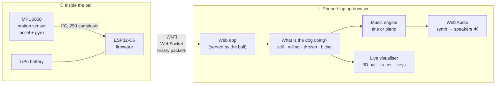
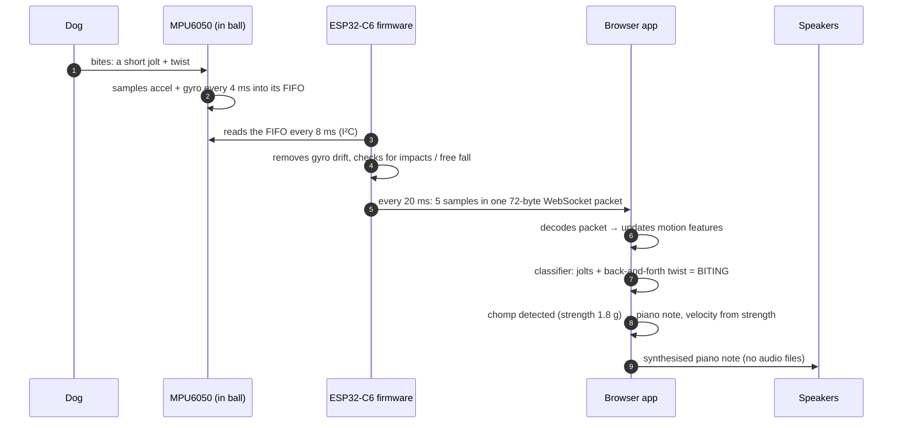
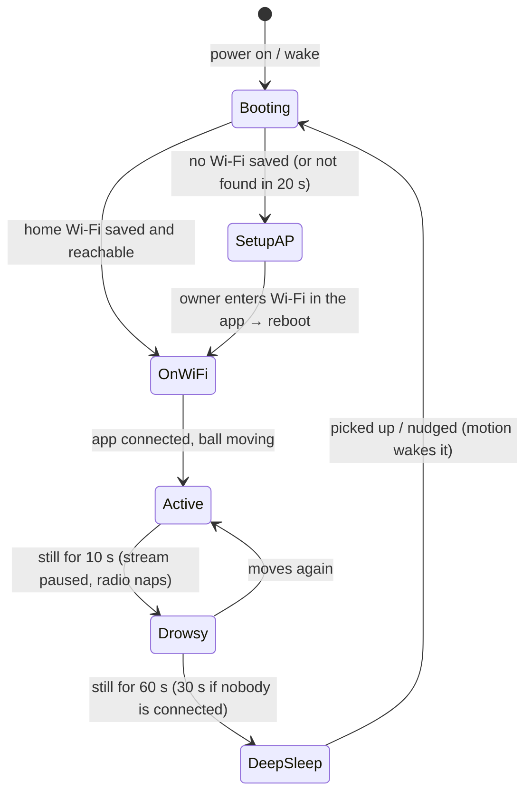
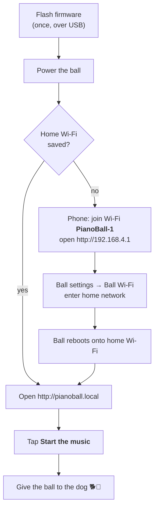

# Piano Ball

**Presentation deck:** [View the web deck](https://aryashjain.github.io/petplay/presentation/index.html#1)

A dog ball that makes music. A small computer (ESP32-C6) and a motion sensor (MPU6050) sealed
inside the ball measure every roll, throw and bite. A web page on your phone or laptop turns
that motion into sound:

| The ball is… | You hear |
|---|---|
| Resting or barely moved | **Silence** |
| Rolling | **"Tin tin tin"**: a metal chime every quarter turn. Faster rolling means faster, higher tins |
| Thrown | Rising chimes in the air, then a bright chime burst on landing, louder for harder landings |
| Being bitten / chewed | **Piano**: each bite plays a note, harder bites play louder, and hard chewing plays more notes with bass and chords |

## Why this exists

Dogs get bored, especially when they're home alone for hours. A bored dog chews furniture,
barks, or just lies around. An ordinary ball only holds its interest for a while, because it
does nothing back.

Piano Ball **responds**. Every roll, throw and bite makes a sound, so the toy rewards the dog
for playing with it:

- **Keeps dogs engaged and active.** A toy that reacts gives the dog a reason to keep nudging,
  chasing and chewing it. That means more exercise and more mental stimulation than a silent ball.
- **Gives chewing somewhere good to go.** Biting the ball plays the piano, so the dog gets
  something back for chewing the toy instead of the sofa or shoes.
- **Lets owners hear the dog playing.** From another room, or live in the browser while
  you're away, you can hear and see when the dog is playing, how hard and for how long.
  "Tin tin" means it's rolling the ball, piano means it's chewing.
- **Quiet when nobody is playing.** It stays silent while the ball rests, so it only makes
  noise during play and not all day. It also sleeps to save its battery.
- **No app to install.** Open a web page on any phone or laptop and it plays.

It's for pet owners who want a more engaging toy, dogs that are left alone during the day, and
anyone who wants to hear what their dog gets up to while they're out.

---

## How it works: the whole flow

### 1. The big picture



Only the **measuring** happens in the ball. The **deciding and playing** happen in the browser.
That keeps the ball simple and low-power, and lets the sound be changed without reflashing
anything.

### 2. One bite, traced end to end

What happens in the roughly 50 ms between the dog's teeth closing and the piano note sounding:



Step by step:

1. **Sense.** The MPU6050 measures acceleration (±16 g) and rotation (±2000 °/s) 250 times a
   second. A built-in 94 Hz filter removes sensor noise. Samples queue in the sensor's own memory
   (FIFO), so none are lost even if Wi-Fi stalls for a moment.
2. **Pre-process in the ball.** The firmware reads the FIFO, removes the gyro's slow drift
   (learned while the ball rests), and watches for two events that must be caught instantly:
   **impacts** (a spike in acceleration, reported within 12 ms) and **free fall** (the ball is
   in the air, with its airtime). Otherwise the data stays raw, so the app can interpret it.
3. **Send.** Every 20 ms, 5 samples are packed into a tiny binary packet (72 bytes) and pushed
   over a WebSocket to every connected browser. Impact and free-fall events jump the queue.
   Once a second a status packet reports battery, Wi-Fi strength and settings. Format:
   [PROTOCOL.md](PROTOCOL.md).
4. **Understand (in the browser).** The app follows the ball's orientation and computes a few
   motion features: how fast and how steadily it spins, how much it is jolted, and whether it's
   in the air. From these it decides what the dog is doing:

   | Behaviour | How it's recognised |
   |---|---|
   | **Still** | ≈1 g, no rotation for 0.5 s |
   | **Rolling** | steady rotation around **one** axis |
   | **Thrown** | free fall (≈0 g) |
   | **Biting** | repeated short jolts ("chomps") + twisting **back and forth**, with no steady spin |
   | Idle | small movements that are none of the above: silent |

5. **Play.** The music engine reacts to that behaviour:
   - **Rolling:** one chime per quarter turn of the ball, higher as it speeds up.
   - **Thrown:** rising chimes while airborne, then a chime burst on landing scaled by impact strength.
   - **Biting:** a piano note on every chomp (velocity from bite strength), a melody that gets
     busier with harder chewing and higher when the ball is twisted, plus bass and chords.
   - **Still:** silence, and any ringing notes are damped.

   Every note comes from the chosen scale, so it never sounds harsh.
6. **Hear and see.** The piano and chimes are synthesised live with the Web Audio API, with no
   sound files. A compressor and reverb keep the output smooth and prevent clipping. At the same
   time the visualiser shows the ball rotating in 3D, impact ripples, motion graphs, and the notes
   lighting up on a keyboard.

### 3. The ball's day: power and connection lifecycle



- In **deep sleep** the ESP32 is almost off (microamps) and the sensor stays in a low-power
  "wake on motion" mode. Nudging the ball wakes it, it rejoins Wi-Fi, and **the app reconnects
  by itself**.
- A low battery sends it to sleep early. Wi-Fi drops are retried automatically, with growing
  pauses between attempts.
- The app's connection pill always shows where things stand: **Live · Resting · Reconnecting ·
  Asleep**.

### 4. From unboxing to music: the user's flow



The ball serves the web app itself, so there's nothing to install and nothing hosted online.
(Browsers only allow the app's WebSocket from a page loaded over `http://` on your network, so
always open it from the ball's address.)

### 5. Where each step lives in the code

| Step | File |
|---|---|
| Pins, rates, thresholds, timeouts | `firmware/main/board_config.h` |
| Sensor driver (FIFO, wake on motion, pin scan) | `firmware/main/mpu6050.c` |
| Gyro drift, impact + free-fall detection | `firmware/main/motion.c` |
| Wi-Fi, setup network, web server, WebSocket | `firmware/main/net.c` |
| Battery, deep sleep | `firmware/main/power.c` |
| Tasks, packets, drowsy/sleep decisions | `firmware/main/main.c` |
| Packet format (shared by C and JS) | `firmware/main/protocol.h` ↔ `web/js/protocol.js` |
| Connection, auto-reconnect, latency | `web/js/link.js` |
| Orientation + behaviour classifier | `web/js/motion.js` |
| Music decisions (tins, piano, scales) | `web/js/composer.js` |
| Piano and chime synthesis | `web/js/piano.js` |
| 3D ball, graphs, keyboard | `web/js/visualizer.js` |
| Demo ball physics (and JS copy of the firmware detector) | `web/js/sim.js` |
| Page wiring and controls | `web/js/app.js` |

```
firmware/   ESP-IDF firmware (C) for the ball
web/        the app: index.html, style.css, js/*.js (no build step, no dependencies)
tools/      mock ball server, WSL build + flash scripts, serial log reader
tests/      node --test tests/*.test.js
PROTOCOL.md binary wire format
```

---

## Try it without hardware

```
node tools/mock_ball.js            # then open http://localhost:8080
node tools/mock_ball.js --flaky 20 # drops the link every 20 s to test reconnection
```

The mock runs the same physics as the demo and speaks the exact same protocol as the real ball.
Or open `web/index.html` straight from disk and choose **Demo ball**. Drag the ball to roll it,
tap it to bounce, press **T** to throw or **B** to bite, or tick **Play fetch** to let a virtual
dog play.

## Hardware

| Part | Connection |
|---|---|
| MPU6050 SDA / SCL | GPIO5 / GPIO0 on ball 1 (I²C, 400 kHz). If the sensor isn't found, the firmware scans the pins and logs where it is |
| MPU6050 INT | GPIO2 (wakes the ball from deep sleep). Without it, set `BOARD_HAS_MPU_INT 0` |
| LiPo + | 100k/100k divider → an ADC pin for the battery gauge (optional; off on ball 1 because GPIO0 is SCL) |

Pad the board and battery so they can't rattle, because rattling reads as impacts. The ±16 g
range covers hard bounces.

## Building and flashing the firmware

On this laptop, Reason Cybersecurity blocks the Windows compiler, so the firmware is built in
WSL2 (Ubuntu) and flashed from Windows:

```
wsl -d Ubuntu-26.04 -- bash tools/wsl_setup.sh          # once: PlatformIO in WSL (no sudo needed)
wsl -d Ubuntu-26.04 -- bash /mnt/c/Users/ADMIN/piano-ball/tools/wsl_build.sh
powershell -File tools/flash.ps1 -Port COM17             # write + boot (USB reset)
python tools/serial_log.py COM17 10                     # watch the boot log
```

On a machine without that antivirus, `powershell -File firmware/build.ps1 upload` builds and
flashes directly. Use the PlatformIO in `~/.platformio/penv` (6.2+): an older
`python -m platformio` removes the pioarduino platform.

## The app

Pick **Ball** or **Demo ball**, then press **Start the music** (browsers need a tap before
they'll play audio). The **Ball is** readout shows what the classifier sees: Resting, Rolling,
Thrown or Being bitten.

- **Music:** scale (8 scales, all consonant), key, tempo for the piano, volume, reverb and
  sensitivity.
- **Ball settings:** impact threshold, sleep timeout, "Put ball to sleep", and Wi-Fi setup.

Settings are remembered per browser.

## Future aspects

The ball already measures every roll, throw and bite 250 times a second, which opens up much
more than music. Planned and possible directions:

### Health and wellbeing

- **Daily activity tracking.** Minutes of play per day, split into rolling, fetching and
  chewing, with intensity and trends over weeks. It would work like a fitness tracker for the
  dog, with no collar to wear.
- **Exercise goals and weight management.** Set a daily play target (for example for an
  overweight or high-energy breed) and see progress. The music can encourage more play when the
  dog is below its goal.
- **Early warning of changes.** A sudden drop in play, or play that becomes slower or shorter,
  can be an early sign of illness, pain, joint problems or low mood. The app could flag unusual
  changes so the owner knows to check with a vet.
- **Chewing and dental insight.** Bite strength and chewing patterns over time. A dog that
  suddenly bites much more softly, or avoids chewing, may have tooth or mouth discomfort.
- **Stress and separation anxiety.** Bursts of intense chewing while the owner is out can point
  to anxiety. Owners could see when it happens and how often, and whether training or routine
  changes help.
- **Ageing and recovery.** Follow an older dog's mobility, or a dog's return to normal activity
  after surgery or injury, with real numbers instead of guesses.
- **Vet reports.** Export a weekly or monthly activity summary to share at check-ups.

> Piano Ball is not a medical device. These features would highlight changes in behaviour so
> owners notice them earlier; they don't diagnose anything. Always ask a vet about health
> concerns.

### Smarter play

- **Music that adapts to the dog.** Learn which sounds and scales get the most play from each
  dog and use more of them.
- **Games and training.** Fetch counters, "find the ball" sounds, and play sessions that reward
  commands.
- **Treat dispenser link.** Reward a good play session with a treat from a connected feeder.
- **Multiple dogs.** Tell balls apart (ball 1, ball 2…) and compare dogs in one household.

### Product

- **Cloud dashboard and alerts.** History, charts and phone notifications ("Max has been playing
  for 20 minutes"), reachable from anywhere, not only on home Wi-Fi.
- **Tougher, pet-safe build.** A food-safe, chew-proof shell, waterproofing, and wireless charging
  so the ball can stay sealed.
- **Longer battery life.** Smarter sleep scheduling and a Bluetooth low-energy mode for short
  sessions near the owner's phone.

## Tests

```
node --test tests/*.test.js
```

22 tests cover:

* The packet format, byte for byte, matching the C structs.
* The behaviour classifier on simulated rest, rolling, biting and throws.
* The sounds: silence at rest, one tin per quarter turn, piano only while biting (bite strength
  → velocity), damping after biting, throw and landing chimes, and every note staying in scale.
* The firmware's detector logic, plus a real WebSocket session with the mock ball (streaming,
  ping, settings, sleep and wake).
